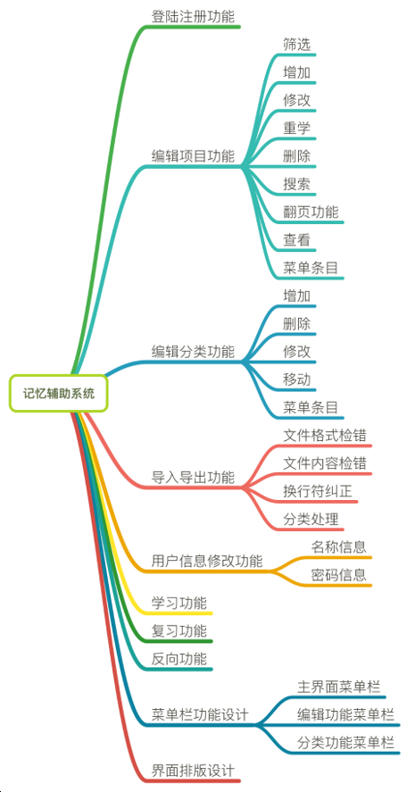
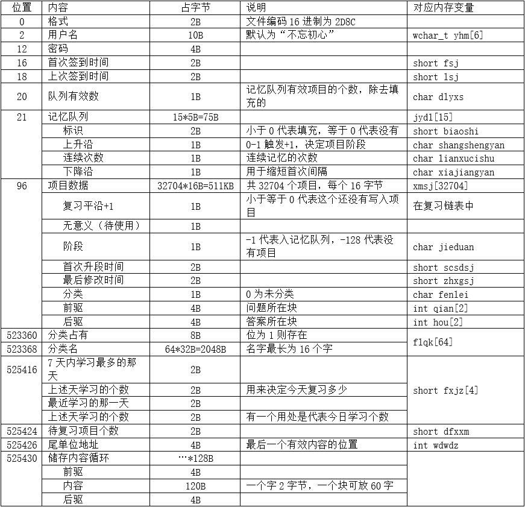
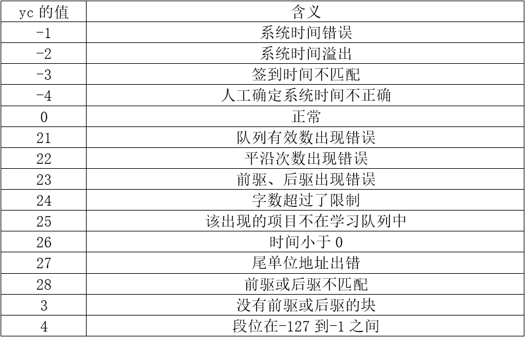

# 介绍

- 本来自己开发用于各种考试学习，最后成了本科优秀毕业设计。开发的那会记忆软件还不多，现在到不少了。
- 使用VS2013基于MFC开发。本系统没做通讯和移动端，因此写了一个按键精灵脚本，可以借助QQ进行移动端远程使用，有兴趣可以看看。

制作该软件是为了降低复习成本和提高学习记忆效率。她会为你定制一套学习计划，只要将你想记忆的东西交给她，如同一位老师。
    记忆辅助的学习算法参考了一本有关学习方法和记忆理论的畅销书《学习这回事》（注：该书由德国心理学家塞巴斯蒂安·莱特纳撰写）。只有当一个项目连续4次被记住才算学习成功，中途若出现未记住的情况则连续次数重新计算。根据人脑记忆的特点，每次记忆的时间间隔也会逐次拉长，逐步实现感觉记忆到短时记忆的转化，有点类似于平常的反复回想式背书，但背的次数与间隔更科学和可掌握。
    复习阶段是根据学习的效果来判断未来再复习的时间，根据遗忘规律来设定间隔天数，将复习控制在遗忘点，达到短时记忆到长时记忆转换的目的。复习阶段是最为重要的阶段，在背大量数据的时候没有一个良好的复习规律是记不住的，比如背单词。在背了大量单词后，会很难掌握复习，因为不知道哪些是已经遗忘的，于是就要把所有单词复习一遍，严重浪费时间和打击积极性。

# 注意
  1. 该软件密码仅供一般防御
  2. 不要在写入数据时关闭软件！
  3. 若有数据错误尽量不要再增删改（找备份吧）
  4. 系统时间错误则不要使用软件
  5. 过了24点重启软件刷新复习数据
  6. 内容限制900字，最多支持32704条项目，数据太多可能会卡顿，请耐心等候
  7. 最多支持到2104年11月9日
  8. 今日已背项目不因删除项目减少，它可能影响以后复习的个数

应用场景：
  1. 工作中的各种材料、经验、事情、常识等等。
  2. 生活中的好句子、常识、知识等等。
  3. 英语中的单词、句子、句型等等。
  4. 课堂、报告上的笔记，书上的知识点等等。
  5. 和自己相关的稍微重要的...

# 设计

- 包含功能的示意图

  

- 未使用数据库，使用自己设计的文件系统。这里将储存所有的关于学习、复习、用户信息、时间信息、项目、进度、分类信息、引导区、标识等等数据。它的后缀名是.ysj。刚新建的文件只有引导区，占525430字节。为了方便增删数据项目，按块的方式处理项目数据，一个块占128字节。

  

- 各种可能的异常值含义

  

# 演示

部分功能的简单展示

